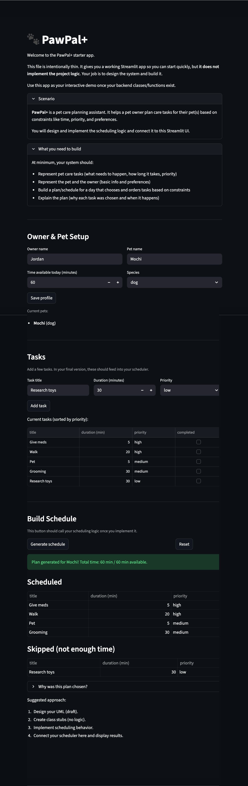

# PawPal+ (Module 2 Project)

You are building **PawPal+**, a Streamlit app that helps a pet owner plan care tasks for their pet.

## Scenario

A busy pet owner needs help staying consistent with pet care. They want an assistant that can:

- Track pet care tasks (walks, feeding, meds, enrichment, grooming, etc.)
- Consider constraints (time available, priority, owner preferences)
- Produce a daily plan and explain why it chose that plan

Your job is to design the system first (UML), then implement the logic in Python, then connect it to the Streamlit UI.

## What you will build

Your final app should:

- Let a user enter basic owner + pet info
- Let a user add/edit tasks (duration + priority at minimum)
- Generate a daily schedule/plan based on constraints and priorities
- Display the plan clearly (and ideally explain the reasoning)
- Include tests for the most important scheduling behaviors

## 📸 Demo



---

## Features

### Priority-based scheduling
Tasks are sorted high → medium → low priority before the daily plan is built. Within the same priority level, shorter tasks are scheduled first to maximise the number of tasks that fit in the available time budget. Any tasks that don't fit are collected in a "Skipped" list with a plain-language explanation.

### Time budget enforcement
Each owner sets a daily time budget (in minutes). The scheduler tracks cumulative time and stops adding tasks the moment the next one would exceed the limit — the total scheduled duration is guaranteed never to exceed `available_minutes`.

### Sorting by priority and duration
`Scheduler._sort_tasks()` applies a two-key sort: `(priority_order, duration_minutes)`. This means two high-priority tasks are always ordered shortest-first, giving the schedule the best chance of fitting the most important work into the day.

### Conflict warnings
`Scheduler.detect_conflicts()` checks all tasks that have an explicit `start_time` for overlapping time windows using interval overlap logic (`a.start_time < b_end and b.start_time < a_end`). Conflicts across different pets are detected too. Warnings are returned as plain strings — the method never raises — and are surfaced in the UI via `st.warning`.

### Daily and weekly recurrence
When a recurring task (`frequency="daily"` or `"weekly"`) is marked complete, a fresh pending instance is automatically re-queued on the pet with its `due_date` calculated using Python's `timedelta` (`today + 1 day` or `today + 7 days`). One-off tasks (`frequency="as-needed"`) are not re-queued.

### Multi-pet support
An `Owner` manages a list of pets. The scheduler aggregates pending tasks across all pets into a single sorted pool before generating the plan, so a household with multiple animals gets one unified daily schedule.

### Task lifecycle management
Each task tracks a `completed` flag. `get_pending_tasks()` filters completed tasks out automatically, so they never re-appear in a generated plan. `reset_all_tasks()` clears all flags at once to start a fresh day.

### Explainable plans
`DailyPlan.explain()` returns a human-readable reason for every scheduling decision — why each task was included and why each task was skipped — displayed in the UI as an expandable section.

---

## Getting started

### Setup

```bash
python -m venv .venv
source .venv/bin/activate  # Windows: .venv\Scripts\activate
pip install -r requirements.txt
```

## Testing PawPal+

### Run the tests

```bash
python3 -m pytest test_pawpal.py -v
```

### What the tests cover

| Area | Tests |
|---|---|
| **Task lifecycle** | `completed` starts `False`; `mark_complete()` and `reset()` toggle it correctly; `frequency` and `due_date` stored accurately |
| **Sorting correctness** | `_sort_tasks()` returns tasks ordered high → medium → low, shortest-first within the same priority level |
| **Recurrence logic** | Completing a `daily` task re-queues a fresh instance due tomorrow; `weekly` due in 7 days; `as-needed` tasks are not re-queued |
| **Pet management** | `add_task()`, `remove_task()`, `get_tasks()`, and `get_pending_tasks()` (excludes completed tasks) |
| **Multi-pet scheduling** | `Owner` aggregates tasks across all pets; `Scheduler` generates a plan from the combined pending task list |
| **Time budget enforcement** | Total scheduled duration never exceeds `available_minutes`; tasks that don't fit are placed in `skipped_tasks` |
| **Conflict detection** | `detect_conflicts()` flags overlapping time windows within and across pets; adjacent tasks are not flagged; tasks without a `start_time` are ignored |
| **Edge cases** | Empty task list, invalid priority value, completed tasks excluded from scheduling, `mark_task_complete` returns `False` when title not found |

### Confidence level

Confidence level: 4/5

Core scheduling, sorting, recurrence, and conflict detection are all tested end-to-end with 38 passing tests. The confidence gap is in boundary conditions not yet covered — zero available time, an owner with no pets, and duplicate task titles across pets.

---

### Suggested workflow

1. Read the scenario carefully and identify requirements and edge cases.
2. Draft a UML diagram (classes, attributes, methods, relationships).
3. Convert UML into Python class stubs (no logic yet).
4. Implement scheduling logic in small increments.
5. Add tests to verify key behaviors.
6. Connect your logic to the Streamlit UI in `app.py`.
7. Refine UML so it matches what you actually built.
