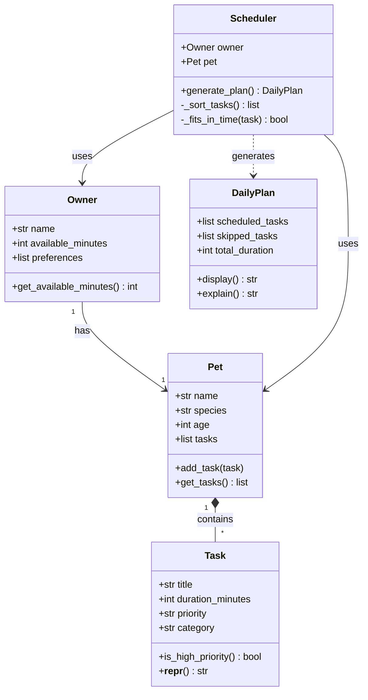

# PawPal+ Project Reflection

## 1. System Design

Three core actions a user should be able to perform:

1. **Set up their profile** — The user enters basic information about themselves (how much time they have available each day, any preferences or constraints) and their pet (name, species, age, any special needs). This gives the scheduler the context it needs to make good decisions.

2. **Manage care tasks** — The user can add, edit, or remove pet care tasks such as walks, feeding, medication, grooming, or enrichment activities. Each task has at minimum a duration and a priority level, so the scheduler knows how long things take and what matters most when time is tight.

3. **Generate and review the daily plan** — The user triggers the scheduler to produce a prioritized daily care schedule based on their available time and task priorities. The app displays the plan clearly and explains why it made the choices it did, so the owner understands the reasoning and can trust the output.

**a. Initial design**

- Briefly describe your initial UML design.

The initial UML consists of five classes. `Owner` and `Pet` are connected by a "has-a" relationship — an owner has one pet. `Pet` holds a list of `Task` objects (composition). `Scheduler` depends on both `Owner` and `Pet` to generate a `DailyPlan`. `DailyPlan` holds two lists of tasks: those that were scheduled and those that were skipped due to time constraints.

- What classes did you include, and what responsibilities did you assign to each?

**`Task`** — represents a single care activity.
- Attributes: `title` (str), `duration_minutes` (int), `priority` ("low"/"medium"/"high"), `category` (str — e.g. walk, feeding, meds)
- Methods: `is_high_priority()` → bool, `__repr__()`

**`Pet`** — holds information about the animal being cared for.
- Attributes: `name` (str), `species` (str), `age` (int), `tasks` (list of Task)
- Methods: `add_task(task)`, `get_tasks()` → list

**`Owner`** — represents the human user and their daily constraints.
- Attributes: `name` (str), `available_minutes` (int), `preferences` (list of str)
- Methods: `get_available_minutes()` → int

**`Scheduler`** — core planning logic; takes the owner's constraints and the pet's task list and decides what fits in the day.
- Attributes: `owner` (Owner), `pet` (Pet)
- Methods: `generate_plan()` → DailyPlan, `_sort_tasks()` → list, `_fits_in_time(task)` → bool

**`DailyPlan`** — the output object; holds the ordered schedule and reasoning.
- Attributes: `scheduled_tasks` (list of Task), `skipped_tasks` (list of Task), `total_duration` (int)
- Methods: `display()` → str, `explain()` → str

**b. Design changes**

- Did your design change during implementation?
- If yes, describe at least one change and why you made it.

---

## 2. Scheduling Logic and Tradeoffs

**a. Constraints and priorities**

- What constraints does your scheduler consider (for example: time, priority, preferences)?
- How did you decide which constraints mattered most?

**b. Tradeoffs**

- Describe one tradeoff your scheduler makes.
- Why is that tradeoff reasonable for this scenario?

---

## 3. AI Collaboration

**a. How you used AI**

- How did you use AI tools during this project (for example: design brainstorming, debugging, refactoring)?
- What kinds of prompts or questions were most helpful?

**b. Judgment and verification**

- Describe one moment where you did not accept an AI suggestion as-is.
- How did you evaluate or verify what the AI suggested?

---

## 4. Testing and Verification

**a. What you tested**

- What behaviors did you test?
- Why were these tests important?

**b. Confidence**

- How confident are you that your scheduler works correctly?
- What edge cases would you test next if you had more time?

---

## 5. Reflection

**a. What went well**

- What part of this project are you most satisfied with?

**b. What you would improve**

- If you had another iteration, what would you improve or redesign?

**c. Key takeaway**

- What is one important thing you learned about designing systems or working with AI on this project?
