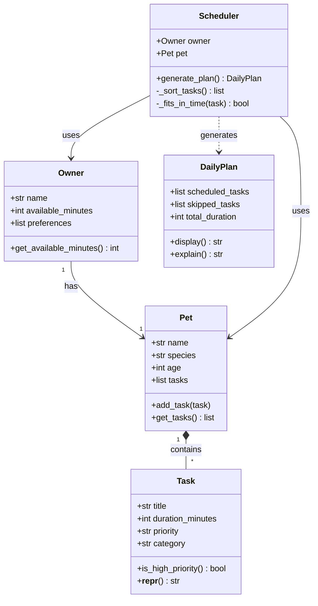

# PawPal+ Project Reflection

## 1. System Design

Three core actions a user should be able to perform:

1. **Set up their profile** — The user enters basic information about themselves (how much time they have available each day, any preferences or constraints) and their pet (name, species, age, any special needs). This gives the scheduler the context it needs to make good decisions.

2. **Manage care tasks** — The user can add, edit, or remove pet care tasks such as walks, feeding, medication, grooming, or enrichment activities. Each task has at minimum a duration and a priority level, so the scheduler knows how long things take and what matters most when time is tight.

3. **Generate and review the daily plan** — The user triggers the scheduler to produce a prioritized daily care schedule based on their available time and task priorities. The app displays the plan clearly and explains why it made the choices it did, so the owner understands the reasoning and can trust the output.

**a. Initial design**

- Briefly describe your initial UML design.

The initial UML consists of five classes. `Owner` and `Pet` are connected by a "has-a" relationship — an owner has one pet. `Pet` holds a list of `Task` objects (composition). `Scheduler` depends on both `Owner` and `Pet` to generate a `DailyPlan`. `DailyPlan` holds two lists of tasks: those that were scheduled and those that were skipped due to time constraints.

- What classes did you include, and what responsibilities did you assign to each?

**`Task`** — represents a single care activity.
- Attributes: `title` (str), `duration_minutes` (int), `priority` ("low"/"medium"/"high"), `category` (str — e.g. walk, feeding, meds)
- Methods: `is_high_priority()` → bool, `__repr__()`

**`Pet`** — holds information about the animal being cared for.
- Attributes: `name` (str), `species` (str), `age` (int), `tasks` (list of Task)
- Methods: `add_task(task)`, `get_tasks()` → list

**`Owner`** — represents the human user and their daily constraints.
- Attributes: `name` (str), `available_minutes` (int), `preferences` (list of str)
- Methods: `get_available_minutes()` → int

**`Scheduler`** — core planning logic; takes the owner's constraints and the pet's task list and decides what fits in the day.
- Attributes: `owner` (Owner), `pet` (Pet)
- Methods: `generate_plan()` → DailyPlan, `_sort_tasks()` → list, `_fits_in_time(task)` → bool

**`DailyPlan`** — the output object; holds the ordered schedule and reasoning.
- Attributes: `scheduled_tasks` (list of Task), `skipped_tasks` (list of Task), `total_duration` (int)
- Methods: `display()` → str, `explain()` → str

**b. Design changes**

- Did your design change during implementation?
    - Tasks with the same priority level should have a tiebreaker. Two "high" priority tasks that together exceed the time budget could both be attempted when one medium-priority task that fits would be more useful.
- If yes, describe at least one change and why you made it.
    - A fix was made so that low-priority short task that fits should not be permanently skipped just because a high-priority long task came before it.

---

## 2. Scheduling Logic and Tradeoffs

**a. Constraints and priorities**

- What constraints does your scheduler consider (for example: time, priority, preferences)?

The scheduler considers two constraints: **task priority** ("high", "medium", "low") and **available time** (the number of minutes the owner has in a day). Tasks are sorted by priority first, then by duration as a tiebreaker within the same priority level. A task is only included in the plan if its duration fits within the remaining time budget.

- How did you decide which constraints mattered most?

Time is the hard constraint — it is a firm limit that cannot be exceeded. Priority is the soft constraint — it guides ordering but does not guarantee inclusion. This ordering reflects the real-world scenario: a pet owner may not be able to complete every task, so the scheduler must decide which ones matter most when time runs out. Preferences are stored on the `Owner` object but are not yet factored into scheduling, making them a future enhancement.

**b. Tradeoffs**

- Describe one tradeoff your scheduler makes.

The scheduler uses a greedy approach: it processes tasks in sorted order and includes each one if it fits, otherwise it skips it and moves on. This means a long high-priority task that consumes most of the budget will always be included over several shorter lower-priority tasks that together might have been more valuable.

- Why is that tradeoff reasonable for this scenario?

For a pet care app, high-priority tasks like medication or feeding have real consequences if skipped — a greedy priority-first approach ensures those are never dropped in favor of lower-stakes tasks like grooming. The simplicity also makes the scheduler's reasoning easy to explain to the user, which matters as much as optimality in this context.

---

## 3. AI Collaboration

**a. How you used AI**

- How did you use AI tools during this project (for example: design brainstorming, debugging, refactoring)?

AI was used throughout every phase of the project. During design, it helped brainstorm the five core classes, their attributes, methods, and relationships, and generated the Mermaid UML diagram. During implementation, it wrote the initial class stubs, fleshed out full logic (scheduling algorithm, session state wiring, multi-pet support), and reviewed the code for logic bottlenecks — for example, identifying that tasks with the same priority had no tiebreaker and that an invalid priority value would silently crash with a `KeyError`. It also wrote the full test suite and kept it up to date as the API changed.

- What kinds of prompts or questions were most helpful?

The most useful prompts were specific and scoped to one concern at a time — for example: *"Review this file and identify missing relationships or potential logic bottlenecks"* rather than a broad *"improve this code."* Asking the AI to explain its reasoning (e.g. *"why was this plan chosen?"*) also helped evaluate whether suggestions made sense before accepting them. Prompts that described the desired behavior in plain language (*"a low-priority short task that fits should not be skipped just because a longer task came before it"*) produced more accurate changes than asking for generic improvements.

**b. Judgment and verification**

- Describe one moment where you did not accept an AI suggestion as-is.

When the AI proposed rewriting `app.py` to replace the "Generate schedule" button logic, it initially overwrote the entire file — removing the original scenario description, expander sections, and hint markdown that were meant to stay. The suggestion was rejected and the AI was asked to make only the minimal necessary changes while preserving the original structure.

- How did you evaluate or verify what the AI suggested?

Before accepting any edit, the proposed change was compared against the original file to check whether anything outside the target section had been touched. For logic changes (like the scheduler tiebreaker), the test suite was run immediately after to confirm all existing tests still passed and that new tests covered the changed behavior. For UI changes, the key check was reading the final file to verify the original markdown was still intact. This habit of reading the diff — not just the result — was the most reliable way to catch over-reach early.

---

## 4. Testing and Verification

**a. What you tested**

- What behaviors did you test?

The 30 tests cover four areas. For `Task`: that `is_high_priority()` returns the correct boolean, that `completed` starts as `False`, and that `mark_complete()` and `reset()` toggle it correctly. For `Pet`: that `add_task()` and `get_tasks()` work, that `remove_task()` removes only the target, and that `get_pending_tasks()` excludes completed tasks. For `Owner`: that `add_pet()` and `get_pets()` work, and that `get_all_tasks()` aggregates across multiple pets. For `Scheduler`: that high-priority tasks are scheduled first, that shorter tasks are preferred over longer ones at the same priority level, that the total time never exceeds the available budget, that completed tasks are excluded from the plan, that tasks are aggregated across multiple pets, that `mark_task_complete()` finds and marks the right task, that `reset_all_tasks()` clears all completed flags, and that an invalid priority value does not crash.

- Why were these tests important?

The scheduler tests were the most critical because they verify the core promise of the app — that the plan respects the time budget and priority ordering. Without these, a subtle bug in `_sort_tasks` or `_fits_in_time` could produce a silently wrong schedule with no visible error. The `get_pending_tasks` and `mark_task_complete` tests matter because the app relies on completed tasks being filtered out on re-runs; if that filtering broke, already-done tasks would re-appear in every plan. The multi-pet aggregation test catches a class of bug that only appears when the system is composed together, not when each class is tested in isolation.

**b. Confidence**

- How confident are you that your scheduler works correctly?

Reasonably confident for the core cases: the tests verify priority ordering, time budget enforcement, tiebreaking by duration, completed task exclusion, and multi-pet aggregation. The greedy algorithm is simple enough that its behavior is predictable and easy to reason about. The main gap in confidence is around edge cases that were identified but not fully tested — particularly when the available time is zero, when all tasks have the same priority and duration, or when an owner has no pets at all.

- What edge cases would you test next if you had more time?

- **Zero available time** — `Owner("Jordan", 0)`: every task should be skipped, and `total_duration` should remain 0.
- **Single task that exactly fills the budget** — a 60-minute task with 60 minutes available should be scheduled, not skipped.
- **All tasks already completed** — `generate_plan()` should return an empty plan rather than crashing or recycling done tasks.
- **Owner with no pets** — `Scheduler(owner).generate_plan()` should return an empty plan gracefully.
- **Duplicate task titles** — `mark_task_complete("Walk")` when two pets both have a "Walk" task: should it complete only the first match, or all of them?
- **Extremely large task list** — verifying that sort stability and time-budget math hold up with dozens of tasks across many pets.

---

## 5. Reflection

**a. What went well**

- What part of this project are you most satisfied with?

The most satisfying part was the progression from design to working code. Starting with plain-language descriptions of three user actions, turning those into a UML diagram, then into class stubs, then into a fully tested logic layer that connects to a live UI — each step built directly on the last. The `Scheduler` in particular went from a simple stub that took a single pet to one that aggregates pending tasks across multiple pets, respects a time budget, sorts by priority with a duration tiebreaker, and handles invalid input without crashing — all driven by tests that made each improvement verifiable. That traceability from requirement to test to working feature is the part that feels most complete.

**b. What you would improve**

- If you had another iteration, what would you improve or redesign?

Currently, the `Owner.preferences` exists but has no effect. The next step would be defining concrete preference rules and having the scheduler filter or re-rank tasks based on them.

**c. Key takeaway**

- What is one important thing you learned about designing systems or working with AI on this project?

The biggest takeaway is that early design decisions have a lasting impact. For instance, designing the `Owner` with a list of pets rather than a single pet wasn't just a convenient shortcut; it allowed the `Scheduler` to easily handle multiple pets later without requiring a massive refactor.